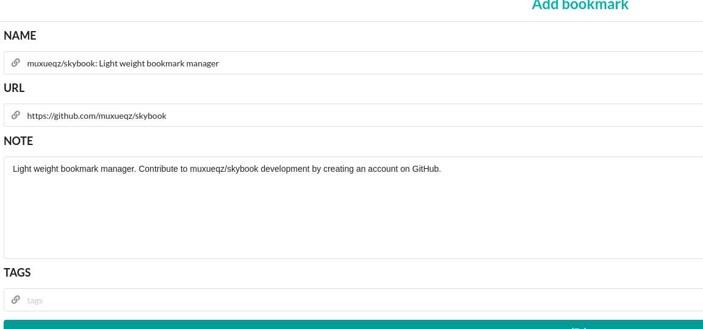
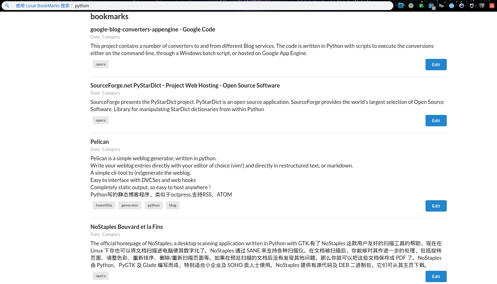

# skybook

Light weight bookmark manager(delicious alternative)

## 特性
* 搜索功能：借助浏览器的自定义搜索引擎功能
* 存储为json文件，可以支持git版本化管理和备份到Github上
* 本地运行，不依赖网络服务，也不用担心服务器被关

## 安装方法[TODO]
* 添加浏览器搜索引擎
* 添加浏览器JS书签

## 使用方法[TODO]
* 搜索演示
* 添加书签演示

