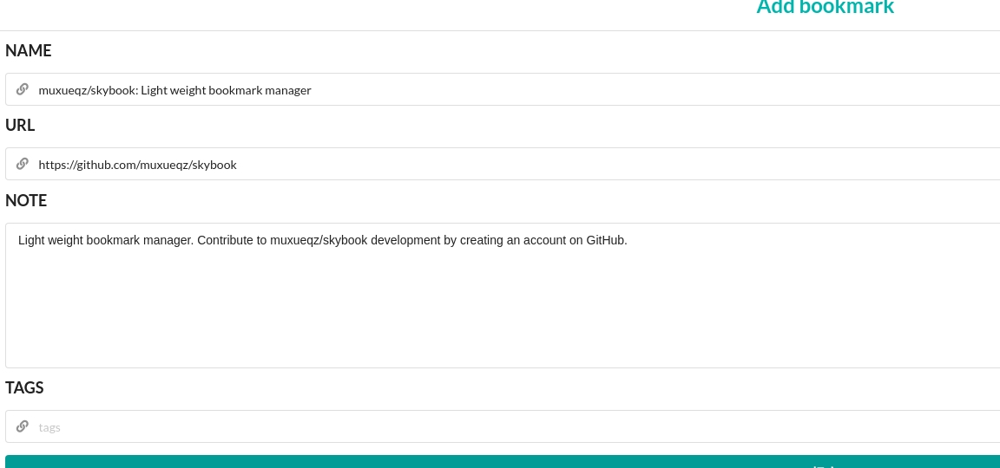
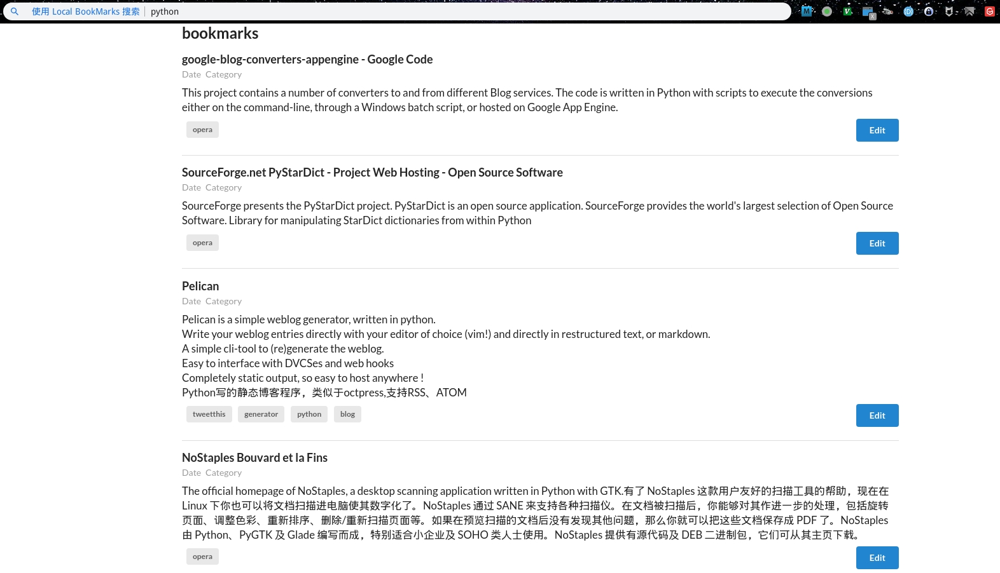

# skybook

Light weight bookmark manager(delicious alternative)

## Features
* Search: via browser custom search engine
* Stores bookmarks as json, supports git versioning and backup to Github
* Runs locally, no network dependency, no server shutdown worries

## Installation [TODO]
* Add browser search engine
* Add browser JS bookmarklet

## Usage [TODO]
* Search demo
* Add bookmark demo

